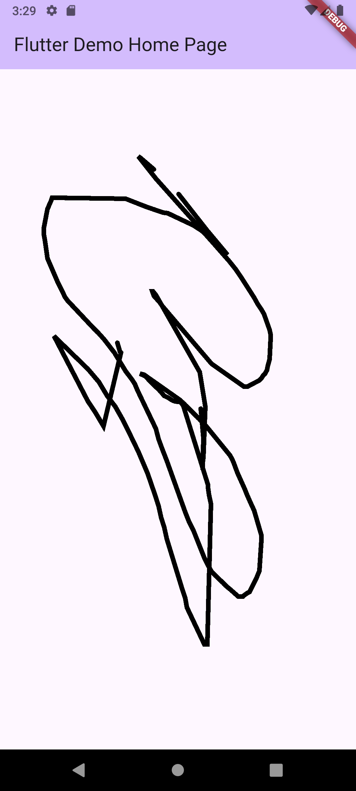

# Basic Drawing Pad

A simple Flutter application that allows users to draw lines on a canvas using their finger or mouse.

## Features

- **Freehand Drawing**: Draw lines on the screen by dragging your finger or mouse.
- **Customizable Canvas**: Utilizes `CustomPaint` for flexible drawing capabilities.

## Screenshot

Here's a screenshot of the application:

| Screenshot |
| :---: |
|  |

## How to Use

1. **Run the application**: 
   ```bash
   flutter run
   ```
2. **Start Drawing**: Simply touch and drag your finger (or mouse) across the screen to draw lines.

## Project Structure

- `lib/main.dart`: Contains the main application logic, including the `MyHomePage` widget which handles touch input and rendering, and the `DrawingPainter` class for custom painting.
